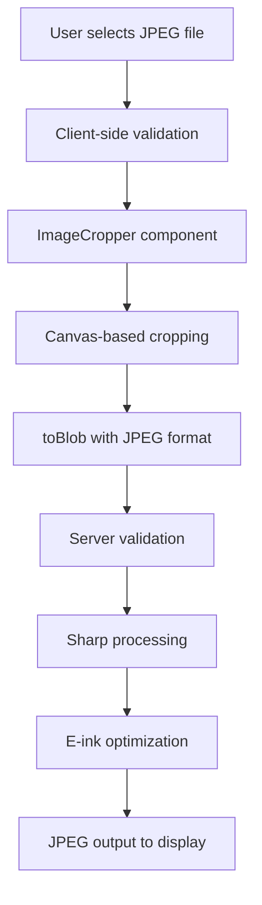
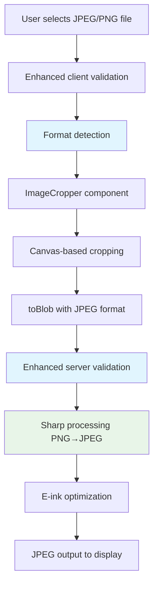
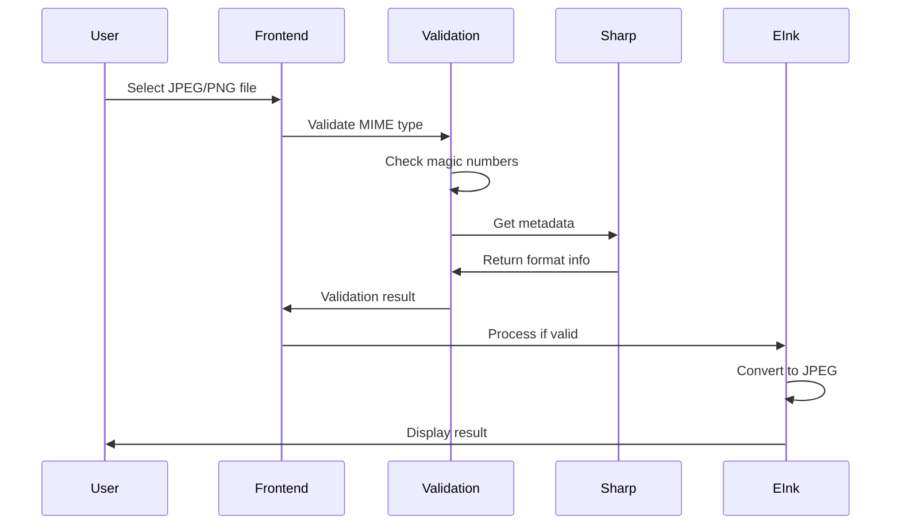
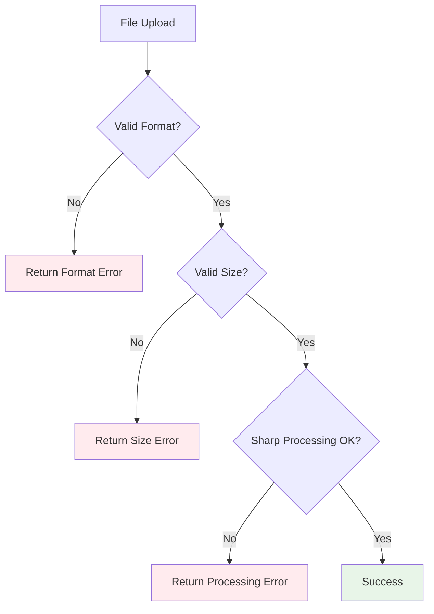

# Image Format Support Enhancement

## Overview

This design document outlines the enhancement of the photo frame application to support PNG input files while maintaining JPEG output after cropping. The current system only accepts JPEG files, but users frequently have PNG images that they want to display. After cropping, all images will continue to be converted to JPEG format for optimal e-ink display compatibility.

## Current State Analysis

### Current JPEG-Only Implementation
The application currently enforces JPEG-only input through multiple validation layers:

- **Frontend validation**: HTML input `accept="image/jpeg"` attribute
- **Client-side validation**: MIME type check `file.type !== 'image/jpeg'`
- **Server-side validation**: Dual validation with MIME type and Sharp metadata
- **Magic number validation**: Security-level validation in documentation

### Current Image Processing Pipeline


## Architecture Design

### Enhanced Image Processing Pipeline


### Component Modifications

#### Frontend Input Layer
The HTML input and client-side validation will be modified to accept both JPEG and PNG formats:

**File Input Enhancement:**
- Accept attribute: `accept="image/jpeg,image/png"`
- MIME type validation: Allow both `image/jpeg` and `image/png`
- File extension validation: Support `.jpg`, `.jpeg`, and `.png`

#### Image Validation Service
Enhanced validation function to support multiple input formats while ensuring JPEG output:

```typescript
interface SupportedFormat {
  mimeType: string;
  extensions: string[];
  magicNumbers: number[][];
}

const SUPPORTED_FORMATS: SupportedFormat[] = [
  {
    mimeType: 'image/jpeg',
    extensions: ['.jpg', '.jpeg'],
    magicNumbers: [[0xFF, 0xD8, 0xFF]]
  },
  {
    mimeType: 'image/png',
    extensions: ['.png'],
    magicNumbers: [[0x89, 0x50, 0x4E, 0x47]]
  }
];
```

#### Sharp Processing Enhancement
The Sharp processing pipeline will be enhanced to handle PNG inputs and ensure JPEG output:

```typescript
export async function validateAndProcessImage(file: File): Promise<{
  isValid: boolean;
  inputFormat: string;
  processedBuffer: Buffer;
}> {
  // Validate input format (JPEG or PNG)
  // Process with Sharp
  // Ensure JPEG output with e-ink optimizations
}
```

## Data Flow Architecture

### Input Validation Flow


### Error Handling Flow


## Component Interface Design

### Enhanced PhotoUploader Component
The PhotoUploader component requires minimal interface changes:

**Props Interface:**
```typescript
interface PhotoUploaderProps {
  onUploadSuccess?: (photo: Photo) => void;
  onUploadError?: (error: string) => void;
  acceptedFormats?: string[]; // New optional prop
}
```

**State Management:**
- Current state structure remains unchanged
- Added format detection in file handling logic
- Enhanced error messaging for format-specific issues

### Enhanced ImageCropper Component
The ImageCropper component interface remains unchanged as it works with image URLs and outputs JPEG blobs regardless of input format:

**Output Specification:**
- Canvas `toBlob()` always generates JPEG format with quality 0.95
- Aspect ratio enforcement remains 5:3 for e-ink display
- Zoom and crop functionality unchanged

### Enhanced Validation Service
The validation service interface expands to support multiple input formats:

**Function Signature:**
```typescript
export async function validateImage(file: File): Promise<{
  isValid: boolean;
  inputFormat: 'jpeg' | 'png' | 'unknown';
  errorMessage?: string;
}>
```

**Magic Number Validation:**
```typescript
function validateMagicNumbers(buffer: Buffer): 'jpeg' | 'png' | 'unknown' {
  // JPEG: FF D8 FF
  // PNG: 89 50 4E 47 0D 0A 1A 0A
}
```

## Implementation Strategy

### Phase 1: Frontend Enhancement
1. **Update File Input Acceptance**
   - Modify `accept` attribute to include PNG
   - Update validation logic in PhotoUploader
   - Enhance error messaging

2. **Client-Side Validation Updates**
   - Expand MIME type checking
   - Add file extension validation
   - Maintain file size limits (10MB)

### Phase 2: Server-Side Enhancement
1. **Enhanced Validation Service**
   - Implement multi-format magic number validation
   - Update Sharp metadata validation
   - Maintain security-first approach

2. **Processing Pipeline Updates**
   - Ensure PNG inputs are processed correctly
   - Maintain JPEG output format
   - Preserve e-ink optimizations

### Phase 3: Testing and Validation
1. **Unit Testing**
   - Test PNG file validation
   - Test PNG to JPEG conversion
   - Test error handling for invalid formats

2. **Integration Testing**
   - End-to-end testing with PNG files
   - Performance testing with various PNG sizes
   - E-ink display compatibility verification

## Security Considerations

### Input Validation Security
Enhanced security measures for multi-format support:

**Magic Number Validation:**
- PNG: `89 50 4E 47 0D 0A 1A 0A` (8 bytes)
- JPEG: `FF D8 FF` (3 bytes minimum)

**File Content Validation:**
- Sharp metadata verification for both formats
- Dimension boundary checks (max 10,000x10,000)
- File structure integrity validation

**Security Boundaries:**
- Maintain 10MB file size limit
- Preserve non-root execution model
- Continue single photo management approach

### Risk Mitigation
- PNG files may be larger than JPEG equivalents - monitor memory usage
- Additional format support increases attack surface - implement strict validation
- Maintain existing security hardening measures

## Performance Considerations

### Memory Usage Optimization
PNG files typically require more memory during processing:

**Sharp Configuration Enhancement:**
```typescript
const SHARP_OPTIONS = {
  limitInputPixels: isPi ? 50 * 1024 * 1024 : 100 * 1024 * 1024,
  concurrency: isPi ? 1 : 2,
  cache: isPi ? { memory: 16, files: 0 } : { memory: 50, files: 20 }
};
```

**Processing Strategy:**
- Single-threaded processing on Pi Zero maintained
- Enhanced memory monitoring for PNG processing
- Progressive processing for large PNG files

### E-Ink Display Optimization
The existing e-ink optimization pipeline remains optimal:

**Processing Chain:**
1. PNG input → Sharp processing → JPEG conversion
2. E-ink color optimization (brightness 1.1, saturation 0.9)
3. Sharpening (1.0, 0.5, 0.5) for clarity
4. High-quality JPEG output (95% quality, progressive: false)

## Error Handling Enhancement

### Client-Side Error Messages
Enhanced user feedback for different scenarios:

```typescript
const ERROR_MESSAGES = {
  INVALID_FORMAT: 'Please select a JPEG or PNG image file.',
  FILE_TOO_LARGE: 'File size too large. Maximum 10MB allowed.',
  PROCESSING_ERROR: 'Failed to process image. Please try a different file.',
  PNG_CONVERSION_ERROR: 'Failed to convert PNG to JPEG. Please try again.'
};
```

### Server-Side Error Responses
Detailed error responses for different validation failures:

```typescript
interface ValidationError {
  success: false;
  error: string;
  errorCode: 'INVALID_FORMAT' | 'FILE_TOO_LARGE' | 'CORRUPTED_FILE';
  supportedFormats: string[];
}
```

## Testing Strategy

### Unit Testing Coverage
1. **Format Validation Tests**
   - Valid JPEG and PNG file validation
   - Invalid format rejection
   - Magic number validation accuracy

2. **Processing Pipeline Tests**
   - PNG to JPEG conversion accuracy
   - E-ink optimization preservation
   - Memory usage validation

3. **Error Handling Tests**
   - Invalid file format handling
   - Corrupted file handling
   - Large file handling

### Integration Testing Scenarios
1. **End-to-End PNG Upload Flow**
   - PNG file selection and validation
   - Cropping functionality with PNG input
   - Server processing and JPEG output
   - E-ink display update verification

2. **Performance Testing**
   - Large PNG file processing (up to 10MB)
   - Memory usage monitoring during PNG processing
   - Processing time comparison between JPEG and PNG inputs

3. **Security Testing**
   - Malicious PNG file handling
   - File format spoofing attempts
   - Memory exhaustion prevention

## Migration Strategy

### Backward Compatibility
The enhancement maintains full backward compatibility:
- Existing JPEG workflow remains unchanged
- No breaking changes to API interfaces
- Existing uploaded photos remain unaffected

### Deployment Approach
1. **Development Testing**
   - Local testing with PNG samples
   - Memory usage monitoring
   - Performance benchmarking

2. **Staging Deployment**
   - Deploy to test Pi hardware
   - Validate e-ink display compatibility
   - Performance testing under realistic conditions

3. **Production Rollout**
   - Gradual rollout with monitoring
   - Rollback plan preparation
   - User feedback collection

## Configuration Updates

### UI Text Updates
User-facing text changes to reflect new format support:

```typescript
const UI_TEXT = {
  supportedFormats: 'Supported formats: JPEG and PNG',
  fileInputLabel: 'Choose JPEG or PNG File',
  dropzoneText: 'Drop JPEG or PNG image here',
  processingMessage: 'Converting and optimizing for e-ink display...'
};
```

### System Configuration
No changes required to:
- Service configuration files
- System permissions
- Hardware setup procedures
- Security hardening scripts