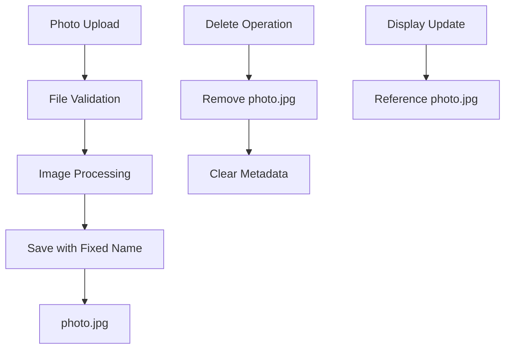
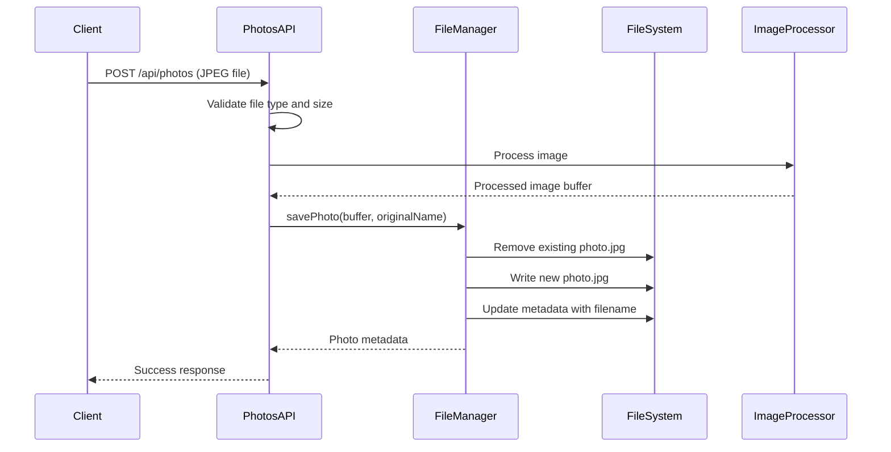
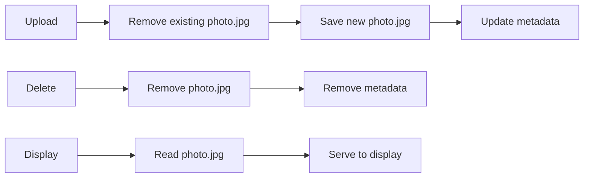

# Photo File Name Standardization Design

## Overview

This design document outlines the implementation of standardizing image file names to `photo.jpg` when saving photos in the photo frame application. Currently, the system uses `current_photo.jpg` as the filename, but this will be changed to a simpler and more consistent naming convention of `photo.jpg`.

## Current System Analysis

### Current File Naming Logic
The photo frame application currently implements single photo management where:
- Photos are saved with the filename `current_photo.jpg`
- The system overwrites the existing photo when a new one is uploaded
- File metadata is stored separately in `storage/config/photos.json`

### Affected Components
- **FileManager Service** (`server/services/fileManager.ts`): Handles file operations and storage
- **Photo Storage**: Physical files stored in `storage/photos/` directory
- **Display System**: References the photo file for display updates

## Architecture Changes

### File Naming Convention Update



### FileManager Service Modifications

The primary change will be in the `savePhoto` method of the FileManager class:

**Current Implementation:**
```typescript
const filename = 'current_photo.jpg';
```

**Updated Implementation:**
```typescript
const filename = 'photo.jpg';
```

### Impact Analysis

| Component | Current Behavior | Updated Behavior | Impact Level |
|-----------|------------------|------------------|---------------|
| File Storage | `current_photo.jpg` | `photo.jpg` | Low |
| Metadata | References old filename | References new filename | Low |
| Display System | Uses fixed file reference | Uses fixed file reference | None |
| API Responses | Returns filename in metadata | Returns filename in metadata | Low |

## Data Flow Architecture

### Photo Upload Process



### File Management Operations



## Implementation Details

### Modified Methods

#### FileManager.savePhoto()
- **Change**: Update fixed filename from `current_photo.jpg` to `photo.jpg`
- **File Path**: `server/services/fileManager.ts` (line 73)
- **Impact**: All photo save operations will use the new filename

#### FileManager.deletePhoto()
- **No changes required**: Method uses the filename from metadata
- **Compatibility**: Will work with both old and new filenames during transition

#### FileManager.saveThumbnail()
- **Change**: Thumbnail filename will also be `photo.jpg` to maintain consistency
- **Location**: `server/services/fileManager.ts` (line 246)

### File System Structure

```
storage/
├── photos/
│   └── photo.jpg                 # Renamed from current_photo.jpg
├── thumbnails/
│   └── photo.jpg                 # Thumbnail with matching name
└── config/
    ├── photos.json               # Metadata referencing photo.jpg
    └── display_status.json       # Display configuration
```

### Metadata Schema

The Photo interface remains unchanged:
```typescript
interface Photo {
    filename: string;           // Will be "photo.jpg"
    originalName: string;       // Preserves user's original filename
    size: number;
    width: number;
    height: number;
    uploadedAt: string;
}
```

## Migration Considerations

### Backward Compatibility
- **Existing installations**: May have `current_photo.jpg` files
- **Graceful handling**: FileManager will work with either filename during transition
- **No breaking changes**: API contracts remain unchanged

### Migration Strategy
1. **Automatic migration**: On first upload after update, old file is replaced
2. **No manual intervention**: System handles transition seamlessly
3. **Metadata consistency**: Filename in metadata automatically updates

## Testing Strategy

### Unit Testing Updates
- **FileManager tests**: Update expected filename in assertions
- **Integration tests**: Verify photo upload/delete with new filename
- **API tests**: Ensure responses contain correct filename

### Test Scenarios
1. **Fresh installation**: Verify photos saved as `photo.jpg`
2. **Existing installation**: Verify transition from `current_photo.jpg`
3. **Upload/delete cycle**: Verify filename consistency throughout operations
4. **Display update**: Verify display system references correct file

## Error Handling

### File Operation Errors
- **Save failures**: Standard error handling remains unchanged
- **Delete operations**: Handle both old and new filenames
- **File not found**: Graceful degradation when photo doesn't exist

### Logging and Monitoring
- **File operations**: Log filename changes for debugging
- **Migration tracking**: Log when old files are replaced
- **Error context**: Include filename information in error messages

## Performance Impact

### File System Operations
- **No performance change**: Same number of file operations
- **Storage efficiency**: Single file naming reduces confusion
- **Cache behavior**: Web browsers may need to refresh cached images

### Memory Usage
- **Unchanged**: Same image processing and storage patterns
- **Metadata size**: Minimal change in metadata file size

## Security Considerations

### File Access Control
- **Same security model**: File permissions and access patterns unchanged
- **Path traversal**: Fixed filename eliminates dynamic path construction risks
- **File validation**: Existing JPEG validation remains in place

### Data Integrity
- **Atomic operations**: File replacement remains atomic
- **Backup considerations**: Simpler filename improves backup clarity